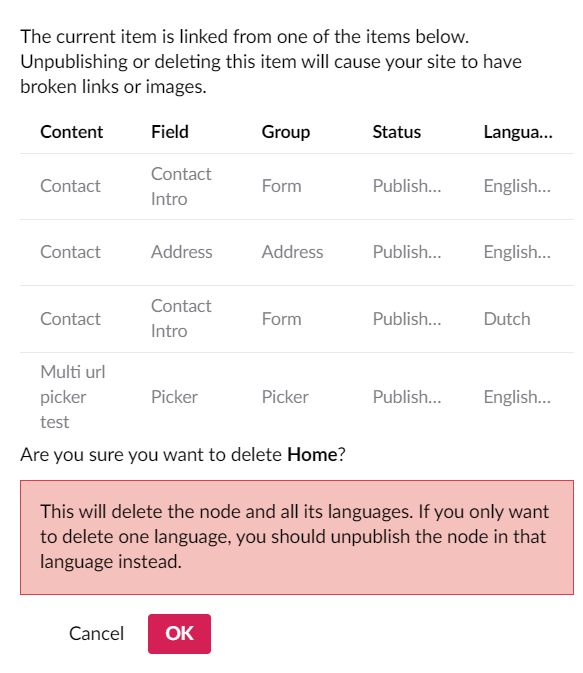
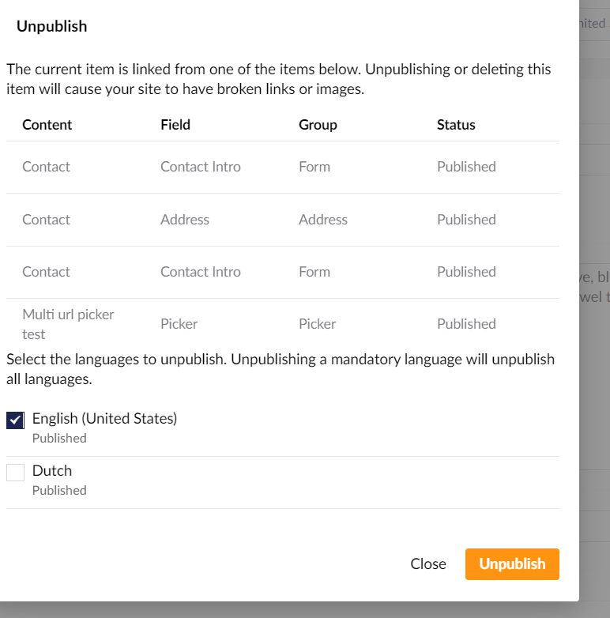
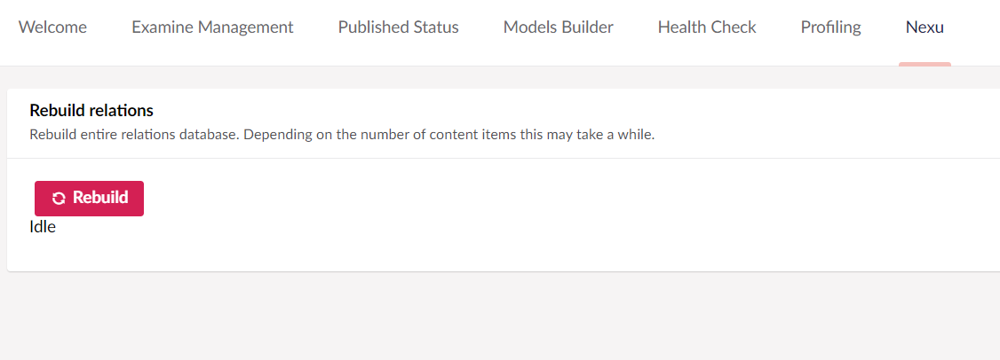

# Introduction #

After installing this package all your internal links will be tracked in Umbraco. This way a content editor can see where a page or media items is used when trying to delete or unpublishing a page and will prevent broken links

## How does it work ##

When content is saved the package will parse all the properties that have a parser configured and store the related items as a relation in Umbraco.

### Delete warnings and unpublish warnings ###

When you try to delete or unpublish a item that is linked to from another item you will get a warning that it is used by other items. You can also see in which property the link is created.

Pages that are unpublished will display in italic and greyed out.
Pages in the recycle bin will be displayed as strike through

From v1.5.0 you can prevent users from deleting or unpublishing used items. Read the [configuration documentation](configuration) on who to do this.

Delete dialog

Unpublish dialog

### Viewing incoming links ###

From v1.5.0 a [property editor](property-editor.md "Property Editor") can be added to documenttypes and mediatypes to allow editors to view the incoming relations.

### Nexu dashboard ###

In the developer section a dashboard is added that allows you to rebuild all the relations. This happens in a background thread, so once you have pushed the button you can continue working in the backoffice. You can go back to the dashboard to check the status.

From v1.5.0 the dashboard will also list the values from the [configuration options](configuration.md)

## Supported property editors ##

### Core property editors ###
- Rich text editor
- Content picker
- Multinode tree picker (content and media)
- Grid
- Related links
- Media picker
- Multiple Media picker
- Nested Content (v7.7+)

### Community property editors ###
- [Nested Content](https://our.umbraco.org/projects/backoffice-extensions/nested-content/)
- [Vorto](https://our.umbraco.org/projects/backoffice-extensions/vorto)
- [Multi Url Picker](https://our.umbraco.org/projects/backoffice-extensions/multi-url-picker/)
- [ArcheType](https://our.umbraco.org/projects/backoffice-extensions/archetype/)
- [Stacked Content](https://our.umbraco.org/projects/backoffice-extensions/stacked-content/)
- [Content List](https://our.umbraco.com/projects/backoffice-extensions/content-list/)
## Supported grid editors ##

### Core grid editors ###
- Rich text
- Media

### Community grid editors ###
- [Doc Type Grid Editor](https://our.umbraco.org/projects/backoffice-extensions/doc-type-grid-editor/)
- [LeBlender](https://our.umbraco.org/projects/backoffice-extensions/leblender/)

