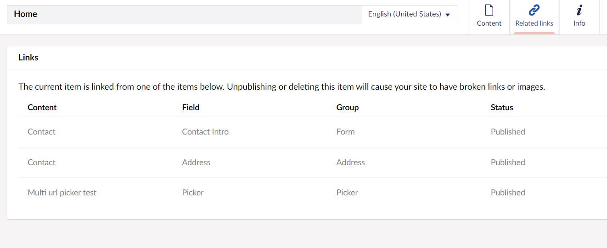

# Introduction #

After installing this package all your internal links will be tracked in Umbraco. This way a content editor can see where a page or media items is used when trying to delete or unpublishing a page and will prevent broken links

## How does it work ##

When content is saved the package will parse all the properties that have a parser configured and store the related items as a relation in Umbraco.

### Delete warnings and unpublish warnings ###

When you try to delete or unpublish a item that is linked to from another item you will get a warning that it is used by other items. You can also see in which property the link is created.

Delete dialog

Unpublish dialog

### Viewing incoming links ###

When a item has incoming links these can be viewed in the Related links content app.

### Nexu dashboard ###

In the settins section a dashboard is added that allows you to rebuild all the relations. This happens in a background thread, so once you have pushed the button you can continue working in the backoffice. You can go back to the dashboard to check the status.

## Supported property editors ##

All built-in property editors that store links are supported.
