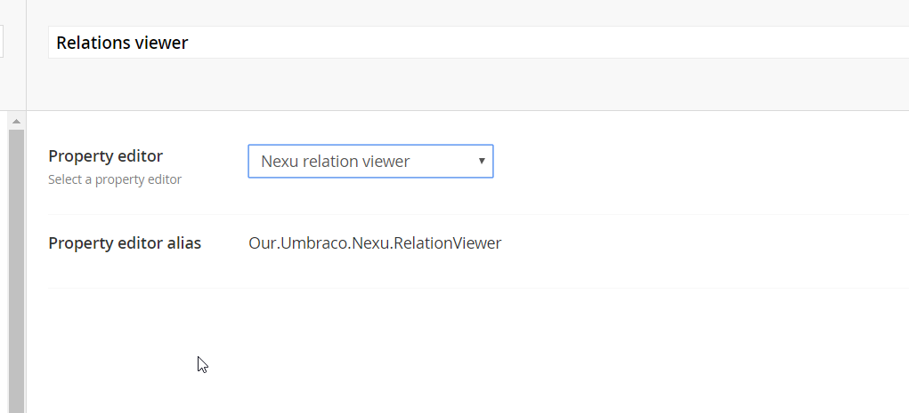
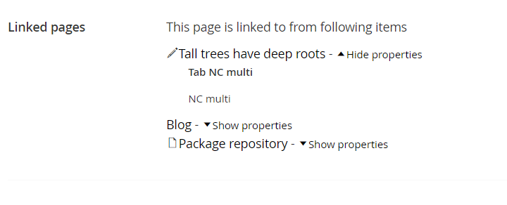

# Property editor #

Since v1.5.0 Nexu comes with a property editor that allows editors to view all incoming links to a page. This way they can see if a page or media item is used before they try to delete or unpublish it.

## Creating a datatype	##

To use the property editor first you need to create a datatype using the Nexu Relations Viewer property editor (alias Our.Umbraco.Nexu.RelationViewer)

## Property editor ##

After you created the datatype you can add it to all your document types and media types. I suggest you use a composition doctype for that.

Now editors can view the incoming links for the item

